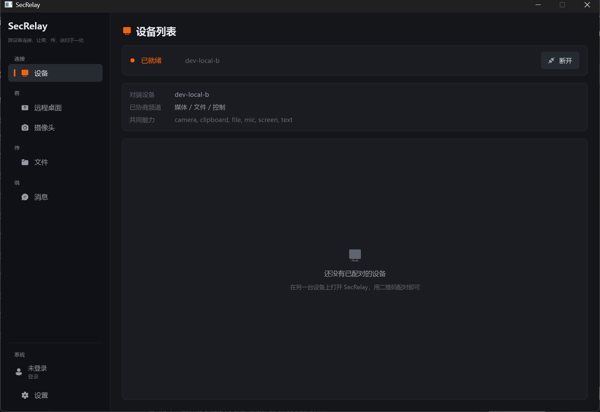
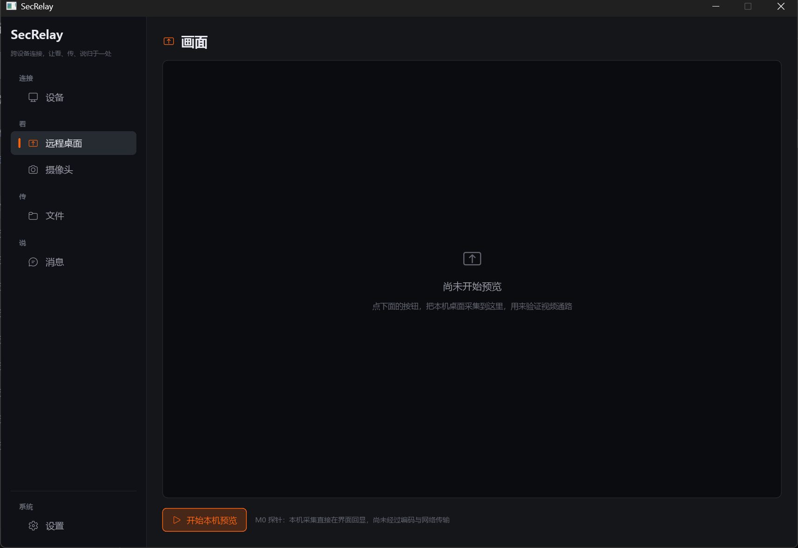
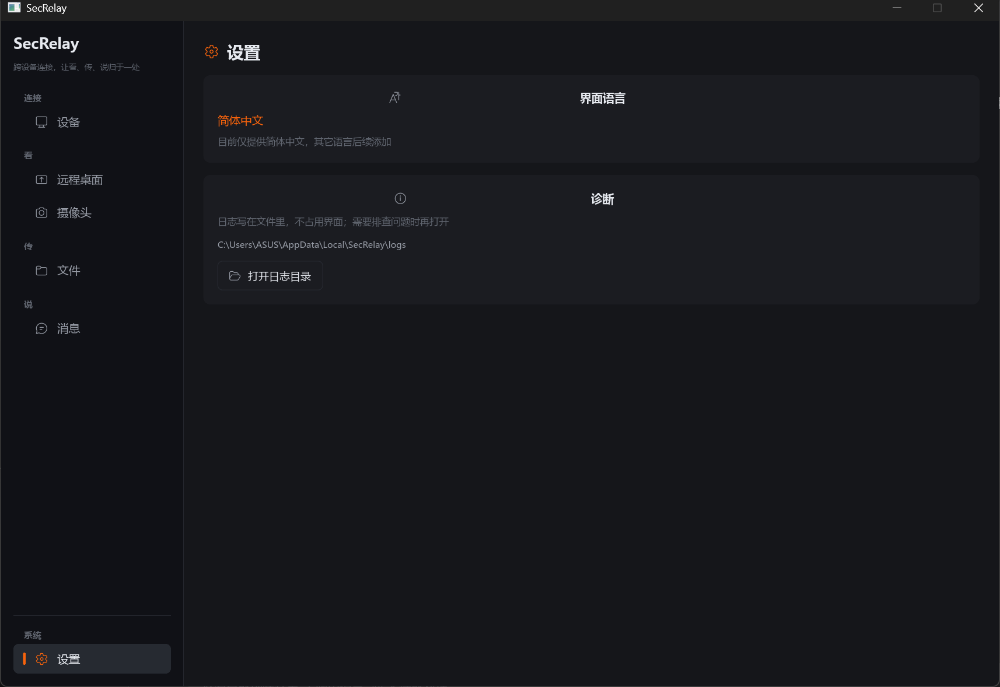
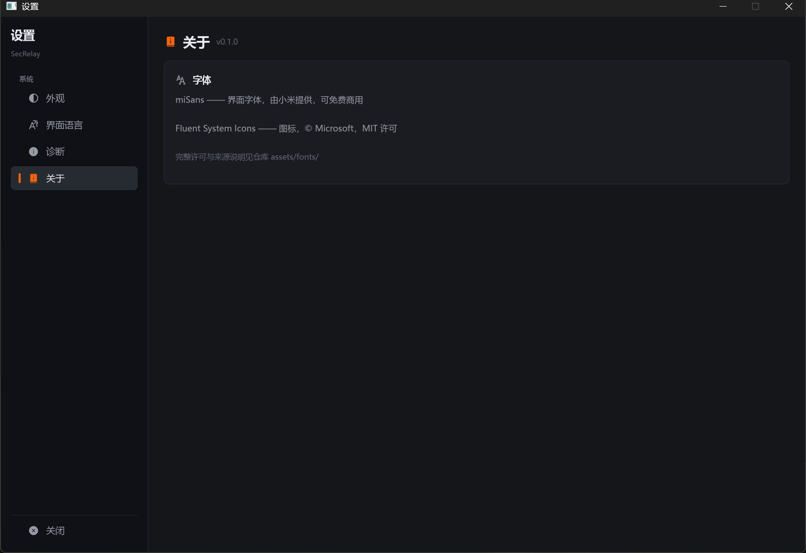

# SecRelay

> **跨设备连接，让看、传、说归于一处**

远程看桌面、远程看摄像头、投屏、传文件、传话 —— 一个跨平台的设备间实时连接层。

**当前状态：M0 骨架。** 协议、能力协商、会话模型已经跑通并有测试覆盖；真实的 P2P 连通性与屏幕采集管线**尚未接入**。

## 快速开始

```bash
cargo test --workspace                    # 90 个测试
cargo run -p secrelay-desktop             # 打开桌面客户端
cargo run -p secrelay-desktop -- --demo   # 自动演示：自动连接并发两条消息
cargo run -p secrelay-desktop -- --demo --preview --page 1   # 含本机画面采集预览

cargo run -p secrelay-cli -- selftest     # 协议与会话模型自检
# 屏幕采集探针（Windows 真实抓屏；其它平台加 --synthetic）
cargo run --release -p secrelay-cli -- capture --seconds 5
```

`selftest` 会在回环传输上验证整套会话模型：握手 → 能力协商 → 三个频道各跑一遍 → 统计 → 有序关闭。
`capture` 量化帧率、抖动与**相邻帧变化比例** —— 实测数据见 [docs/measurements.md](docs/measurements.md)。

```bash
cargo run -p secrelay-cli -- channels   # 打印频道模型
cargo run -p secrelay-cli -- help
```

> ⚠️ 性能相关的测量**必须用 release 构建**。同一采集探针 debug 11.6 fps / release 113.8 fps。

## 界面

左侧是**导航栏**，按「看 / 传 / 说」分组；最底部单独一行是**系统 → 设置**。
右侧一次只显示**一个页面**，不把功能堆在一起。

| 设备 | 远程桌面 |
|---|---|
|  |  |

| 消息 | 设置（独立窗口，与主窗口同尺寸） |
|---|---|
|  |  |

| 关于（字体署名） |
|---|
|  |

三条界面约定：

1. **日志不出现在界面上。** 诊断信息写进 `%LOCALAPPDATA%\SecRelay\logs`（按天滚动），
   界面只在设置窗口提供"打开日志目录"的入口。用户视角不应该感觉到日志的存在。
2. **消息不是日志。** 会话消息有自己的列表模型（左右分栏气泡），与内部事件彻底分开 ——
   否则用户会在"发消息"的地方看到一堆内部事件。
3. **界面里没有面向用户的字面量，也没有写死的颜色。** 文案由 Rust 从 `secrelay-i18n`
   注入到 `Strings` 全局；颜色由 Rust 按「主题模式 + 系统强调色」注入到 `Theme` 全局。

### 窗口结构

- **主窗口**：左侧导航（按「看 / 传 / 说」分组的功能页面）+ 底部「账号 / 设置」，右侧当前页面。
- **设置窗口**：**独立窗口**，由导航栏底部的「设置」打开（不占主窗口的页面位）。
  **与主窗口同尺寸、同样有侧边栏**（外观 / 界面语言 / 诊断 / 关于），避免开关设置时窗口跳变。
- **账号入口**：在导航栏底部、设置上方。位置已就位，但 SECTL-auth 接入尚未实现 ——
  界面上如实显示「未登录」，不做假登录。

### 主题

主题模式三选一，**默认跟随系统**：

| 模式 | 行为 |
|---|---|
| 跟随系统 | 读系统的深浅色偏好（Windows 注册表 / macOS `defaults` / GNOME `gsettings`） |
| 浅色 | 始终浅色 |
| 深色 | 始终深色 |

强调色始终取系统强调色（Windows 注册表 / macOS / GNOME·KDE·GTK），取不到则回退
Windows 出厂默认蓝 `#0078D4`。强调色会按当前配色做**可读性校正** —— 但阈值刻意定得很低
（0.12），以免把 Apple 蓝、GNOME 蓝这类官方系统色也一起改掉。

用户选择持久化在 `%LOCALAPPDATA%\SecRelay\config.txt`（纯 `key=value`，可手工编辑）。

### 字体

**默认 miSans**（随应用分发，不依赖用户装了什么），可改成系统里任意已安装字体：

| 设置项 | 说明 |
|---|---|
| 字体 | 下拉框列出系统全部字体（本机 253 个），内置 miSans 排第一 |
| 字重 | 下拉框只列出**所选字体实际提供**的档位 |

字重这一项是刻意这样设计的：选了某个字体后，如果给一个它没有的字重，
渲染器会去**合成假粗体**（字面糊、笔画粘连）。所以先枚举该字体真实存在的字重，
用户选的值会就近落到实际档位，下拉框里显示的也是真正生效的那个。

⚠️ miSans 的粗体是**另一个字体族**（`MiSans Demibold`，不是 `MiSans` 的权重），
所以 Slint 侧分了 `Theme.ui-font` / `ui-font-bold` / `ui-weight` / `ui-weight-bold`
四个属性，由 `secrelay-theme::fonts` 的 `FontCatalog::resolve` 算出来。
详见 [assets/fonts/README.md](assets/fonts/README.md#最大的坑demibold-是另一个字体族)。

字体许可：miSans 免费商用，但**要求在软件中注明使用了 MiSans** ——
这条已在设置窗口的「关于」页满足（不是只写在文档里）。见
[assets/fonts/LICENSE-MiSans.md](assets/fonts/LICENSE-MiSans.md)。

`--demo` 会自动跑完整闭环（握手 → 协商三频道 → 双向文字消息）；
`--preview` 会启动本机画面采集；`--page N` 可直接打开指定页面，方便截图与演示。

> **远程桌面页当前显示的是本机采集回显，不是远程画面。** 页面上有明确文案说明这一点 ——
> 界面不假装连通性已经跑通。真实的远程画面要等编码与 P2P 就位。

## 核心设计：一条通道 + N 种频道

所有功能都归约为**一条端到端加密通道上的多路逻辑流**，而不是各自一套连接逻辑：

| 频道 | 承载什么 | 特性 | 已实现 |
|---|---|---|---|
| `Media` | 屏幕 / 摄像头 / 麦克风 | 低延迟优先，**允许丢帧** | 线格式与投递 ✅，采集编码管线 ⬜ |
| `File` | 文件、剪贴板大对象 | 必达、有序、可分块续传 | 线格式与投递 ✅，分块协议 ⬜ |
| `Control` | 文字消息、桌面提示、会话控制 | 必达、有序、量小 | ✅ 含文字消息 |

由此得到两个省工作量的结论：**「投屏」不是独立功能**，它是 `Media` 频道的一种显示形态；**「手机摄像头投屏到电脑」= 手机开 `camera` 能力 + 电脑订阅**，零新增管线。

## 四条硬约束

1. **P2P 优先**：数据默认走设备直连；打洞失败才走中继（转发密文），对方离线才走服务器密文暂存。
2. **服务器零知识**：信令、中继、消息暂存都无法解密任何内容。
3. **核心与 UI 解耦**：`crates/*` **不允许依赖任何 UI 框架**。UI 层只显示帧、显示状态、发出意图。
4. **不做远程控制**：只做「看」，不注入鼠标键盘。

## 目录结构

```
crates/
  secrelay-protocol/    线格式、频道模型、控制消息（纯逻辑，可编译到 WASM）
  secrelay-transport/   连接抽象：ICE 直连 / 中继 / QUIC 文件通道收敛到一个 trait
  secrelay-session/     会话编排：握手、能力协商、频道管理、事件流
  secrelay-media/       媒体层：frame / capture / synthetic / convert / backend + PNG 编码器
  secrelay-i18n/        国际化：类型安全文案目录（当前仅简体中文）
  secrelay-theme/       主题色：读取系统强调色（Windows 注册表 / macOS defaults / GNOME·KDE·GTK）
apps/
  secrelay-cli/         命令行工具、M0 自检与采集探针
  secrelay-desktop/     桌面客户端（Slint UI：左侧导航 + 分页面 + i18n + 图标字体）
tools/
  gen-icons/            从图标字体生成 Slint 码位表（零依赖 TTF 解析）
assets/
  fonts/                Fluent System Icons（MIT）+ 许可证与使用说明
docs/
  需求分析.md            主文档：需求、平台矩阵、选型、风险、决策点
  measurements.md       M0 探针实测记录（可复现的性能数字）
  账号系统接入.md        SECTL 账号系统（OAuth + 云存储）的可选接入设计
  research/             四份专项调研（UI 框架 / 平台能力 / 传输媒体 / Web 端）
```

**只有 `apps/secrelay-desktop` 允许依赖 Slint。** `crates/*` 里没有一处 UI 依赖 ——
这条边界用 CI 检查（待办），它是"换 UI 框架只是换一层壳"这个承诺的唯一保障。

`secrelay-transport` 里那个 trait 是**刻意设置的隔离层**：`webrtc-rs` 生态仍在动荡，文件通道的实现路径（复用 ICE + `quinn` vs `iroh`）也还没定，两者都必须被挡在这一层后面。

## 已实现 / 未实现

**已实现**
- 帧编解码（频道 + 类型 + 长度前缀；控制消息 JSON，媒体/文件原始字节）
- 能力协商（取交集决定开启哪些频道；`Control` 永远存在）
- 会话状态机（Init → Handshaking → Ready → Closed）与握手超时
- 心跳自动应答、有序关闭、传输统计（含中继标记，用于中继占比 KPI）
- 回环传输（让协议与会话逻辑可以脱离真实网络被测试）
- **Windows 屏幕采集**（DXGI Desktop Duplication，2560x1600 实测 113.8 fps / p50 8.69ms）
- 合成画面源（无显示器环境下可测试，且变化区域可控）
- 帧差分度量（脏矩形差分的依据：实测相邻帧 0.02%~0.54% 变化，峰值 31%）
- 自写 PNG 编码器（零依赖截图，用于文档配图与缺陷复现）
- **桌面客户端**（Slint UI：**左侧导航分组 + 分页面**，中文 i18n，日志写文件不进界面）
- **类型安全 i18n**（68 条文案 × 简体中文；新增语言漏翻会编译失败）
- **跟随系统强调色**（Windows 注册表 / macOS / GNOME·KDE·GTK；取不到则回退 Windows 出厂默认蓝 `#0078D4`）
- **浅色 / 深色 / 跟随系统**三态主题（系统深浅色偏好同样按平台探测）
- **界面字体可选**：下拉框列出系统全部字体 + 内置 miSans（默认），字重按字体实际档位选
- **Fluent System Icons 实心图标**（码位由 `tools/gen-icons` 从字体生成，不手抄；
  字体在编译期由 Slint 嵌入）
- 本机画面预览（采集 → 像素转换 → 界面显示；实测 CPU 拷贝路径约 1 个核心，见 measurements）

**未实现（下一步）**
- 真实的 ICE 打洞 / 中继兜底 / 第二条 QUIC 文件通道（D24 未定）
- H.264 编解码与**脏矩形差分实现**（探针已证明收益，尚未实现）
- 鼠标指针合成（不合成指针的远程桌面不可用）
- Linux / macOS / Android 的采集后端
- 视频显示（UI 里的视频画面区域还没做）
- 端到端加密（SFrame / Noise）、设备身份与二维码配对
- 离线消息后端（双棘轮）
- Web 客户端

## 相关仓库

- `SecRelay-Relay` —— 信令与中继服务（无账号验证、零知识、带配额）
- `SECTL-auth` —— 组织账号系统；SecRelay **不依赖**它，登录是可选的渐进增强

## 许可证

GPL-3.0-or-later。有一个未决问题：Web 端分发与中继这类网络服务场景下是否改用 **AGPLv3**（见 `docs/需求分析.md` D23）。**在定下来之前不要假定许可证是最终形态。**
